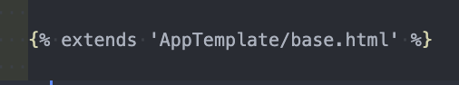
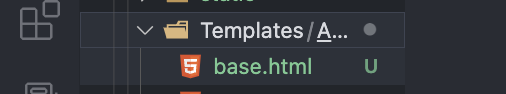
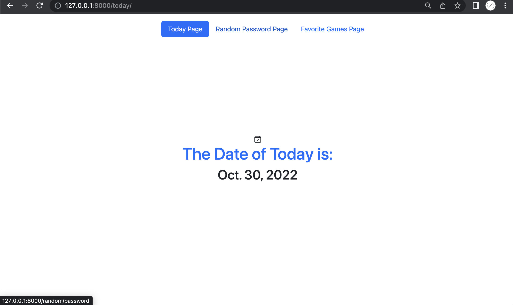
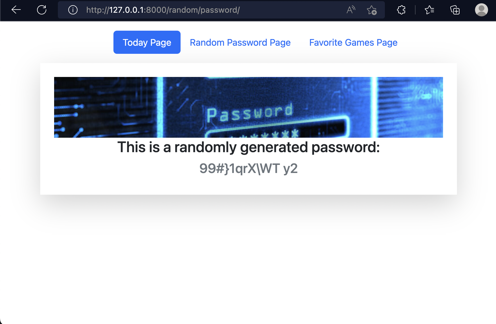
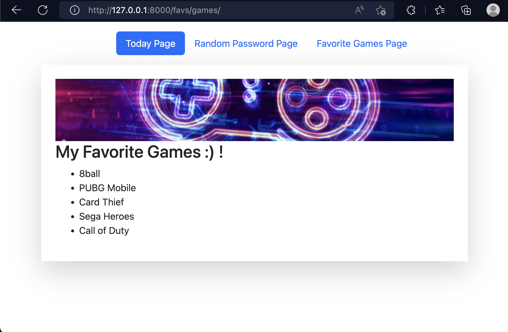

# LAB_DJANGO_TEMPLATE_INHERITANCE

# Using your previous LAB Django Templates , do the following :
- [x] Create a base.html template

    

- [x] Let other templates inherit from base.html

    

- [x] Use Bootstrap to style it (add navigation bar)

     ``` today/ ```

    

     ``` random/password/ ```

    

    ``` favs/games/ ```

    
